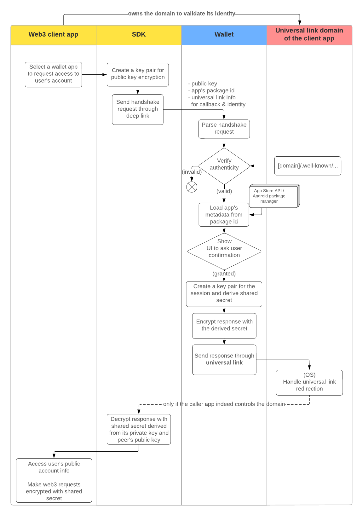

# Handshake

- Host wallet verifies the client app
    - well-known data for universal link configuration
- Fetch metadata of the app such as app’s name and icon image url 
- Show UI (e.g. user confirmation popup) to get user’s approval
- Generate a key pair for session

