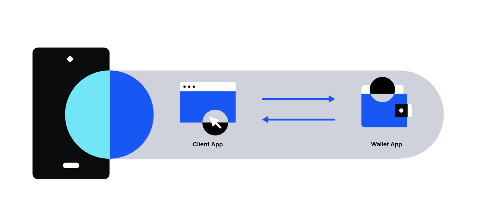

# Overview

## Mobile Wallet Protocol

MWP is a protocol to allow mobile web3 apps to interact with wallet apps and access users' web3 accounts. 
It creates a direct channel between client and wallet apps, removing the need for an intermediary bridge or relay server. 

- Simple: The messages sent by the client app are called requests and the ones returned by the wallet host are called responses.
- Direct: The protocol uses deep links as its transport layer to let participating apps deliver messages directly to their peer without external entities such as a bridge server.
- Secure: It provides an encrypted P2P communication channel between client and server (wallet host) to exchange discrete stateless messages.
- Efficient: Reduces the number of hops between client applications and wallet via support for batch requests.
- Decentralized and reliable: It defines a decentralized verification procedure to check authenticity of each other using well-known URI standard for univeral link without a centralized registry.
