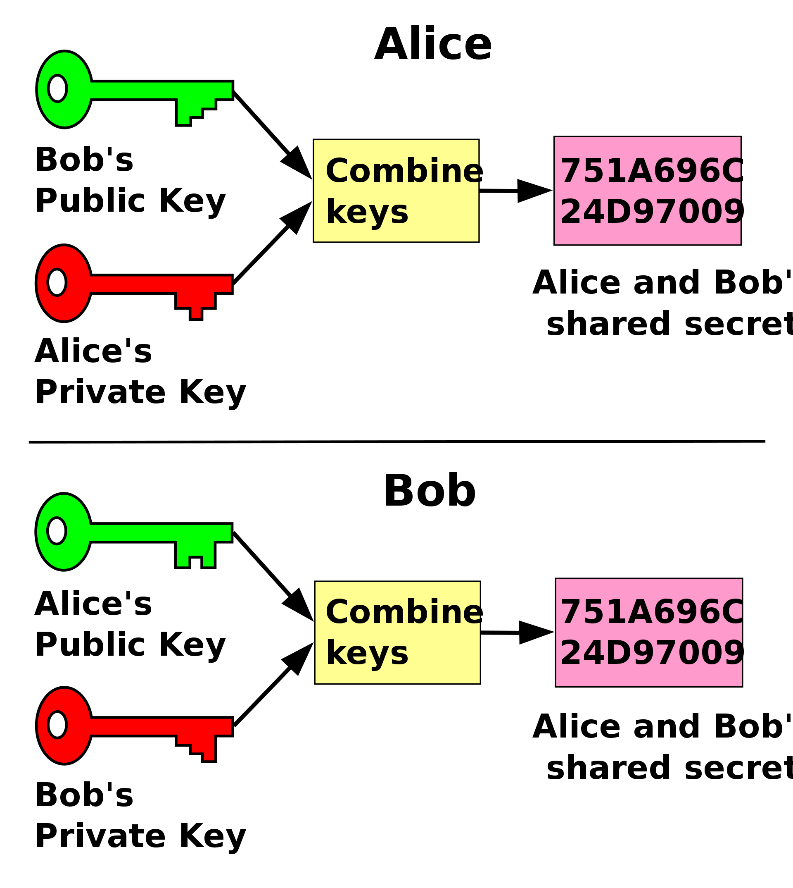

# Encryption

MWP uses deep links for direct communication between peers.

To ensure security, all messages in MWP after secure key exchange process are end-to-end encrypted.

## Key generation

Both the client and the wallet generate their own key pair for each session via [Key-agreement protocol](https://en.wikipedia.org/wiki/Key-agreement_protocol) using [Elliptic-curve](https://en.wikipedia.org/wiki/Elliptic-curve_cryptography).

Each peer stores its private key in secure persistent storage
and share its public key with the other party.

## Key exchange to derive shared secret

MWP uses [Diffie–Hellman key exchange](https://en.wikipedia.org/wiki/Diffie%E2%80%93Hellman_key_exchange) method to securely share cryptographic keys over deep links.

This method allows the two parties to derive the same shared secret offline using its own private key and the peer's public key.

## Message `content` encryption

After successful [handshake process](handshake) to exchange keys, subsequent messages ([`content` data](messages#content)) are encrypted with the common shared secret using a symmetric-key algorithm.

It uses [AES](https://en.wikipedia.org/wiki/Advanced_Encryption_Standard)-[GCM](https://en.wikipedia.org/wiki/Galois/Counter_Mode) algorithm for cryptographic operations.

### Example message after encryption
```json
{
  "version": "1.0.3",
  "sender": "lEC/X3K68rlgOoldMdk0D77738Y7W0mDbMMV5R6VyCE=",
  "content": {
    "request": {
      "data": "bgPGRoCBgH10b0IUhs8ZWRRPhFBGUlS3ESmB+xiGNb7n7oUdU9L9PGABmla/kCdnmES6iWXI7u5xzKm/CzPMGvlvlXLuRGlU4RjGJqbcQ55He3UcBXOgB0q489Vx2cx0fllrISuo87//kfcSolCWNSCHSBuSmojORG8YmO1L20724C8YKQrPxjmfWm5YyZxp/HyTnwX60eRJb819FZI4Zfc4RkTp4h+1A2lzBlERelr+MojfVBBBwxv4qQTAn7QRbUgoU+1CfblqcuB7bHUvfl+OwyZqIoxP68agkU9Na3aKDSM+oK6q9IBKG5X4Vz1+CBVchR5vggY+D7Omdaes6uDL443yV3uf8XHyv5ieWGgIS8bGgkdPvMrAtv78wdBr6iWLlh0pF7RyrPOWq/h8WiYerbAD9RFYhAxo1z3dymFgLamn/rf1LS+xu+sClKDrFx3DYkHEa/75CyQokBQiJFqO/sCTBLnXzV5I9bbjTTGuHi5tE/lKnsMsDz5tBpedavo9BT2bJNRUGh7yPMFybxV1hjyamlobBxyxik2GNjh09bINpZ4HVxe3mpmQWdg0NZiE5HG08HRHWooV+wQavMsWLqmOQtH30dy3+WMRSfURrrVdRXm0TZda6wCdU+sPbLPuvWucfdCTG62P8rGqklavjDQL8kkWAnsgMkCnAQJyoGqFHtGxjNd3rH5Pmkd7RC34fkEOsXxxKMzyOMlZjgr4a1MHO0URbrgA5k3IPdQ83Iq2GRpboshyHRyy27ClH6She9rQXUnbRI7WcGK/YCVu97rTxjWT8AzS8twI7egN6BhyricjMoUXNCewxWUBO4pp316mHtnPyktvFAZxF5Q/hbM2bcFQS2fdWooRUWlB405yv+magBC89GDbJHwBN73q3KTtYFVb5N7vDVIU71eGhL6ehve3NPcGxLKbRXWxWQnKNpIeWZ9W2mNWI5C6mbaasPbgGxW228OEs9FxjNmdA6XCScctgb8b31nM8xPOWeD+q33UIdNpQvkrZicPu7f5lGXGYibjsXnNWdO3tiOg6kuiHevt5Jqp35bO1Vn6y3UzZu6xwbUZQbE4NmR6j9BlGuNGS40Y91O/eCrFzSyayxPl6plRoekn2djBGHDyBZVwXfSKQef6gK9jV1RxQTjKbO6rDGR1hRgqWDvDeDLg03GBqwP93ZwqANK1jxpLOm0wbUycCl8grwAzTrZ0bJ68aUlT/Jmi3VAyV4QAwED8IZ0ipjLz7EmXkQWjuhChIiSwjkR6EEfctQhLK1+xvLsY796OSXG18qTAfjx2vgyGoxxrmEnufTIh4a9A+CTYQzNU137aRLXK/rN7Xs0d51xbis/FVm9ysgBNuWfxlOpVeahkvNSHzAM7Wn4WP/nlWp1yly/R/KrEE5iFi2dVxE9UMQFcbJ/xFDl+dj4hMJDFdCf1tyuP+ZCF6VSOjNUt6TCn2uXNTjIIJj2ZuH3O0YETcESMy+HwR8mmqn4DaFbbzRkZo7szOR3kGzKU8yk0fuW+McZtXfGd9YWG6wZEdMSV210jsmnDHklgHND87Zw0uZBdOWAYc6KzmTU1i2FxOEZaCjCGm9NDaVtgb1+gjrMUQN4KTuEWKaFpW74dZQymnfR9W/SYjH62DRLLEMDBV3xJDXl8fUgusnXMbLvf97fe/qZ7X1fgK70cWDJRTYSvziOC9knXQgOnr94bGaqWbzr7I2x6ODgTC6dczM9HJWOHjNvV8jouhgQIRldOaKA7ALLIEslhA6beJ/hnD2C2JpVwrcur/rCi2RZ5YOC3NKSvOv2sn4PG3++dpqHah1Zi4sdBKRxngSRCCcC1i123zmO3O4zSzI1i/Lo="
    }
  },
  "timestamp": 689610765.957546,
  "callbackUrl": "myappxyz://mycallback/wsegue",
  "uuid": "71BCE700-D717-4463-B4E4-4ECDCFC179A3"
}
```

### Example message before encryption (internal usage)
```json
{
  "version": "1.0.3",
  "sender": "lEC/X3K68rlgOoldMdk0D77738Y7W0mDbMMV5R6VyCE=",
  "content": {
    "request": {
      "actions": [
        {
          "paramsJson": "{\"address\":\"0x571a6a108adb08f9ca54fe8605280F9EE0eD4AF6\",\"message\":\"message\"}",
          "method": "personal_sign",
          "optional": false
        },
        {
          "paramsJson": "{\"typedDataJson\":\"{\\\"types\\\":{\\\"Identity\\\":[{\\\"type\\\":\\\"uint256\\\",\\\"name\\\":\\\"userId\\\"},{\\\"type\\\":\\\"address\\\",\\\"name\\\":\\\"wallet\\\"}],\\\"Bid\\\":[{\\\"name\\\":\\\"amount\\\",\\\"type\\\":\\\"uint256\\\"},{\\\"name\\\":\\\"bidder\\\",\\\"type\\\":\\\"Identity\\\"}],\\\"EIP712Domain\\\":[{\\\"name\\\":\\\"name\\\",\\\"type\\\":\\\"string\\\"},{\\\"name\\\":\\\"version\\\",\\\"type\\\":\\\"string\\\"},{\\\"name\\\":\\\"chainId\\\",\\\"type\\\":\\\"uint256\\\"},{\\\"name\\\":\\\"verifyingContract\\\",\\\"type\\\":\\\"address\\\"},{\\\"type\\\":\\\"bytes32\\\",\\\"name\\\":\\\"salt\\\"}]},\\\"primaryType\\\":\\\"Bid\\\",\\\"message\\\":{\\\"bidder\\\":{\\\"userId\\\":323,\\\"wallet\\\":\\\"0x3333333333333333333333333333333333333333\\\"},\\\"amount\\\":100},\\\"domain\\\":{\\\"salt\\\":\\\"0xf2d857f4a3edcb9b78b4d503bfe733db1e3f6cdc2b7971ee739626c97e86a558\\\",\\\"name\\\":\\\"DApp Browser Test DApp\\\",\\\"chainId\\\":1,\\\"version\\\":\\\"1\\\",\\\"verifyingContract\\\":\\\"0x1C56346CD2A2Bf3202F771f50d3D14a367B48070\\\"}}\",\"address\":\"0x571a6a108adb08f9ca54fe8605280F9EE0eD4AF6\"}",
          "method": "eth_signTypedData_v3",
          "optional": false
        }
      ]
    }
  },
  "timestamp": 689610765.957546,
  "callbackUrl": "myappxyz://mycallback/wsegue",
  "uuid": "71BCE700-D717-4463-B4E4-4ECDCFC179A3"
}
```

## Messages without encryption

However, there are two exceptions where the content data are not encrypted:
1. Handshake calls from the client in order to exchange keys with the wallet
2. Failure responses from wallet to return errors happening during the handshake processes

### Example handshake request message
```json
{
  "version": "1.0.3",
  "sender": "lEC/X3K68rlgOoldMdk0D77738Y7W0mDbMMV5R6VyCE=",
  "content": {
    "handshake": {
      "appId": "com.coinbase.SampleClient",
      "callback": "myappxyz://mycallback/wsegue",
      "initialActions": [
        {
          "paramsJson": "{}",
          "method": "eth_requestAccounts",
          "optional": false
        }
      ]
    }
  },
  "timestamp": 689587969.289106,
  "callbackUrl": "myappxyz://mycallback/wsegue",
  "uuid": "451711FA-96B6-4955-B6EA-EFA78CEB89F5"
}
```

### Example failure response message
```json
{
  "version": "1.0.3",
  "sender": "lEC/X3K68rlgOoldMdk0D77738Y7W0mDbMMV5R6VyCE=",
  "content": {
    "failure": {
      "requestId": "B78F510E-DD5C-4477-8350-7550FAC7452E",
      "description": "Request denied"
    }
  },
  "timestamp": 689611333.369556,
  "uuid": "E485820B-8F5E-4F8C-9A00-CE5B5B9C6F35"
}
```

## Implementation

Coinbase's SDK is built with 
[Apple CryptoKit](https://developer.apple.com/documentation/cryptokit/) for iOS, 
[Google Tink](https://github.com/google/tink) and [androidx.security](https://developer.android.com/jetpack/androidx/releases/security) for Android.


> source: https://commons.wikimedia.org/wiki/File:Public_key_shared_secret.svg
