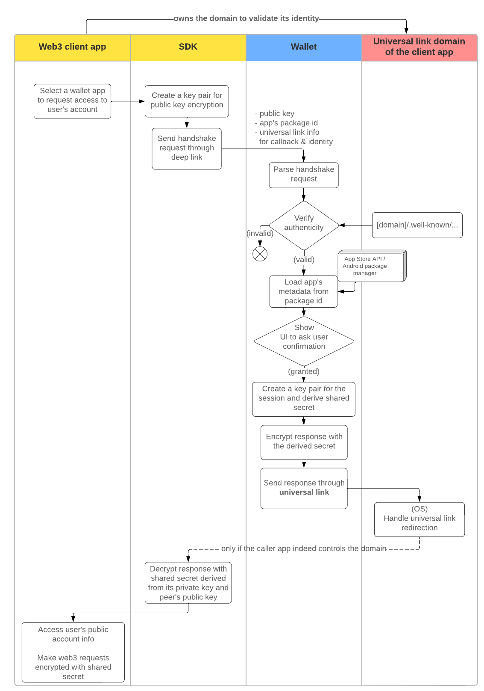

# Verification

Decentralized verification of participating apps’ authenticity using [.well-known](https://en.wikipedia.org/wiki/Well-known_URI) data without centralized registry
- [apple-app-site-association](https://developer.apple.com/documentation/xcode/supporting-associated-domains) 
- [assetlinks.json](https://developer.android.com/training/app-links/verify-site-associations )

3rd party client apps make requests to the wallet through universal links, whose authenticity is verified by the OS.
- Wallet sends responses through universal links as well.
- Application ID passed by caller should match the information on their domain.

MWP host wallets load metadata from the iOS App Store / Android package manager with the client app's `appId`.

